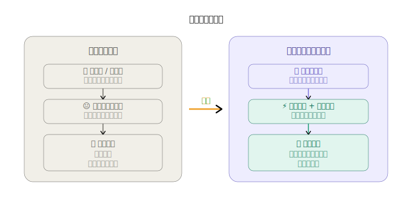
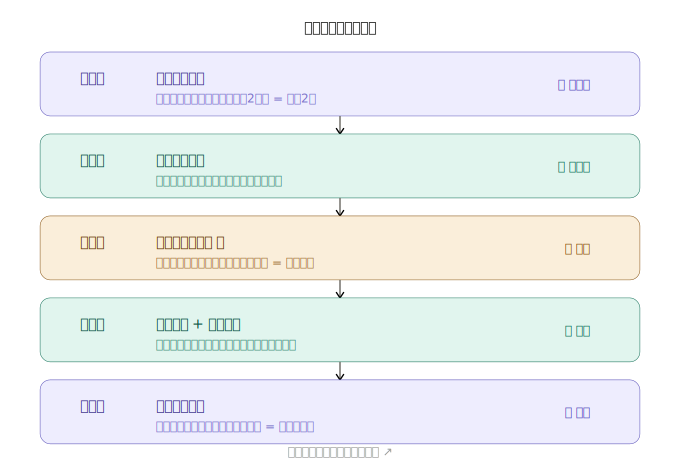

好，现在来把这套学习方法论做成一套可视化图表。我会分三张图来呈现核心思想。接下来是核心的五阶段学习框架：最后是时间分配对比和提问能力与学习效率的关系图：三张图分别展示了：

**图一** — 传统 vs 大模型时代的学习范式对比，一眼看清两种模式的本质差异。

**图二** — 五阶段框架的完整流程，而且每个阶段都可以点击，直接深入追问细节（试着点一下）。

**图三** — 时间分配对比 + 三条黄金法则，记住最底下那句话：**你是研究者，不是学生**。

